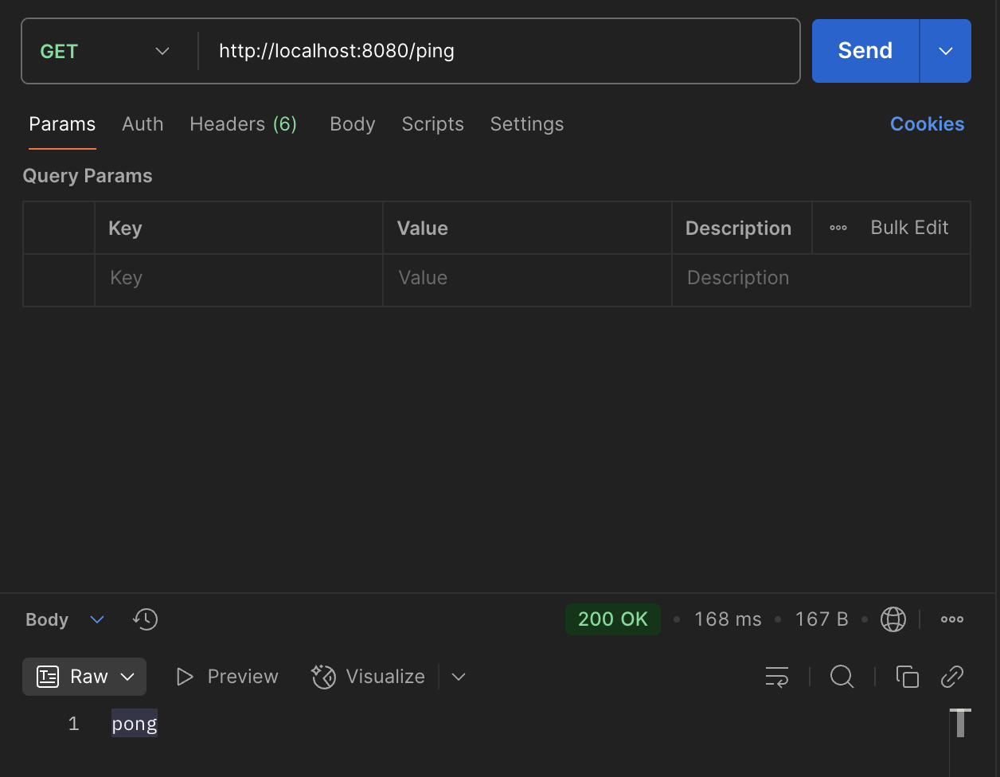
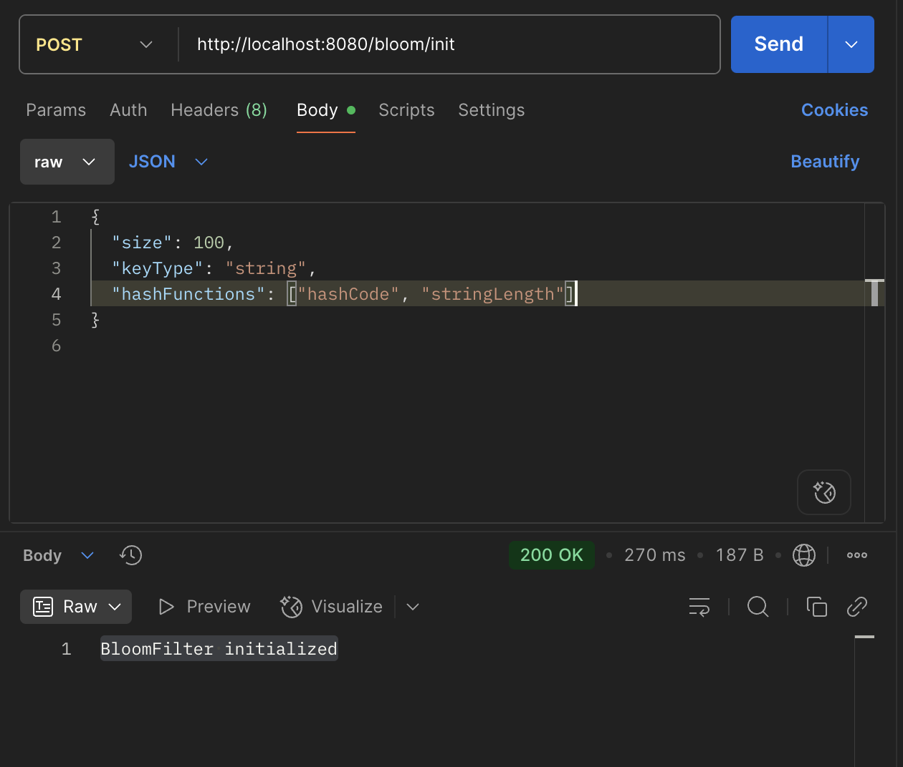
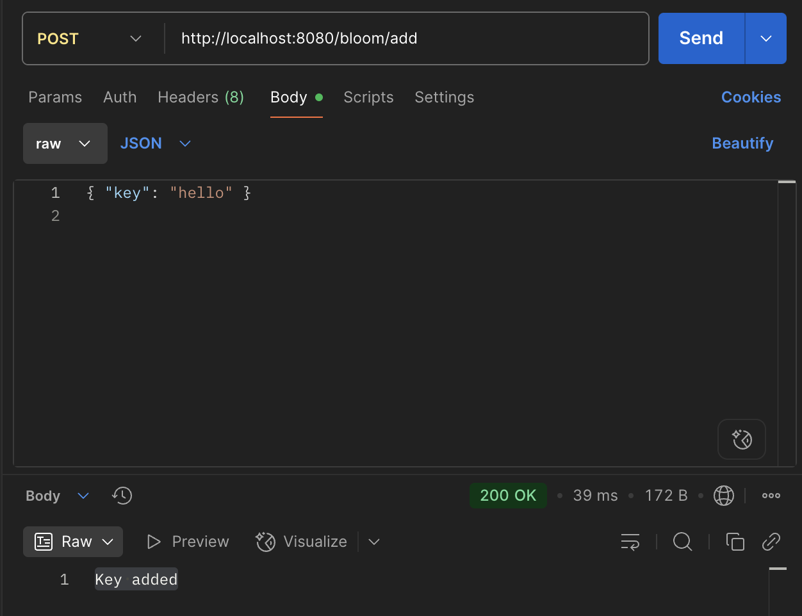
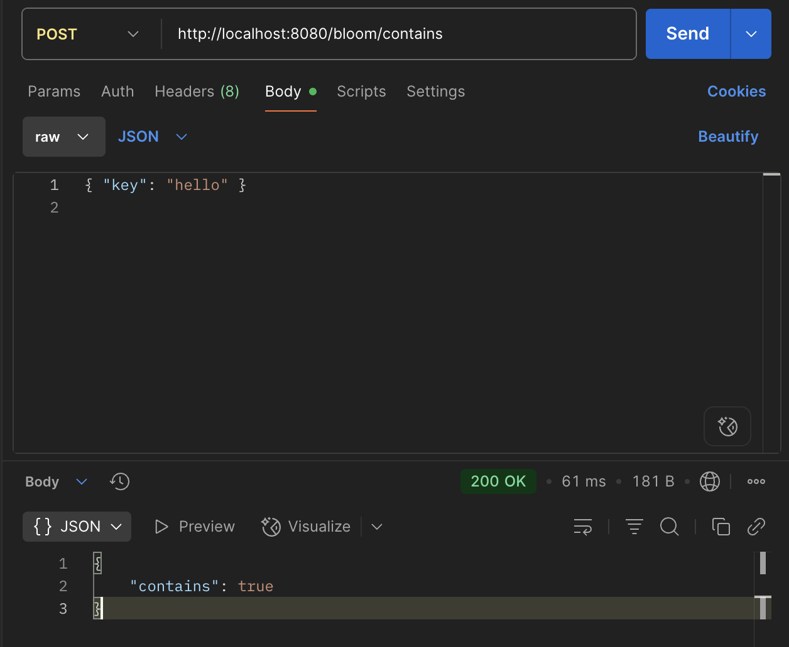
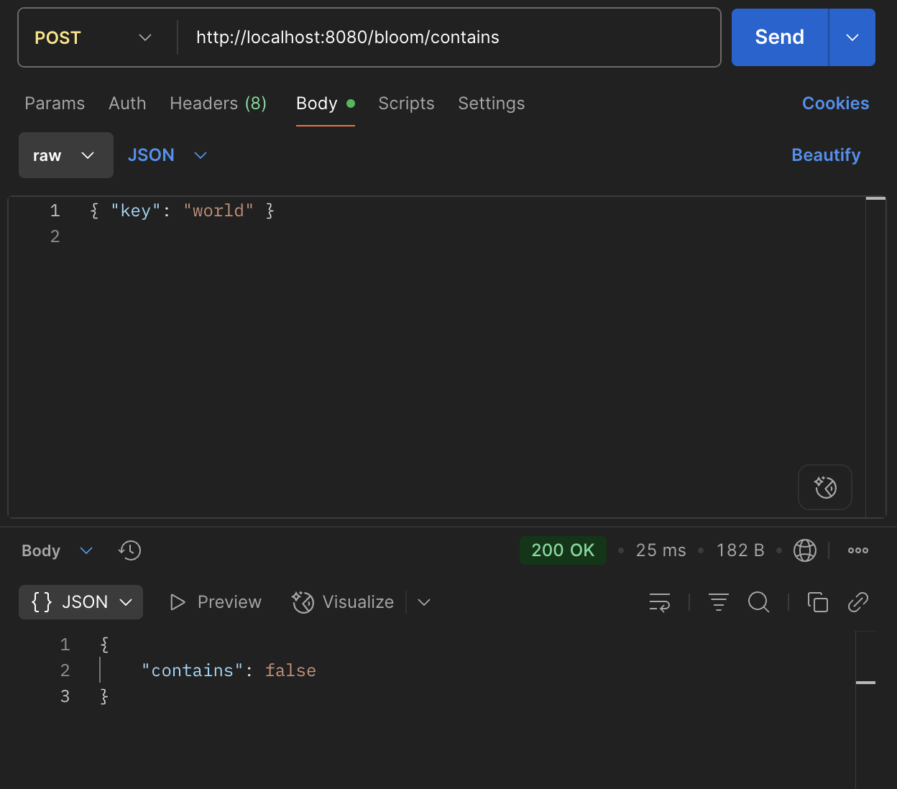

# Lab1 & Lab2 — Spring Boot Bloom Filter Server

## Функционал

**Lab1:**  
Простой HTTP сервер с одним GET-эндпоинтом:
- `/ping` — отвечает `"pong"`.

---

**Lab2:**  
Реализация API фильтра Блума:
- **`/bloom/init`** (POST) — инициализация фильтра (размер, тип ключа, список хеш-функций)
- **`/bloom/add`** (POST) — вставка ключа в фильтр
- **`/bloom/contains`** (POST) — проверка, содержится ли ключ в фильтре

---

## Примеры запросов

**Пинг:**
GET /ping
→ "pong"

**Инициализация фильтра:**
POST /bloom/init
Body:
```
{
  "size": 100,
  "keyType": "string",
  "hashFunctions": ["hashCode", "stringLength"]
}
```
→  
```
"BloomFilter initialized"
```


**Добавить ключ:**
POST /bloom/add
Body:
```
{ "key": "hello" }
```
→
```
 "Key added"
```

**Проверка ключа:**
POST /bloom/contains
Body:
```
{ "key": "hello" }
```
→
```
{ "contains": true }
```

---

**Примеры работы:**
*Ответ сервера на GET /ping*


*Инициализация фильтра Блума через POST /bloom/init*


*Добавление ключа в фильтр через POST /bloom/add*


*Проверка наличия ключа через POST /bloom/contains (тест - существует)*


*Проверка наличия ключа через POST /bloom/contains (тест - не существует)*



